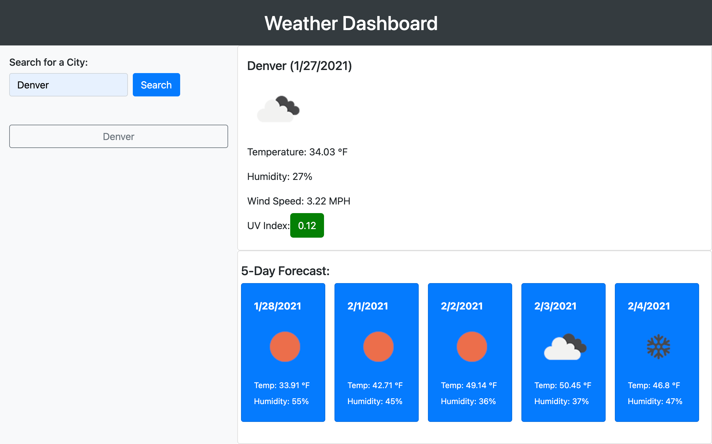
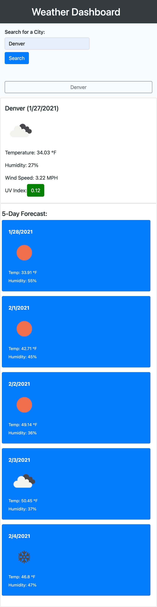

# Weather-Dashboard

## Description 

This application helps individual's research weather conditions of a city, for any use such as planning a road trip or weekend getaway. The application provides a five day forecast as well, complementing the future trip planning use of the application.

This application was created to test my skills in JavaScript, jQuery, CSS, and HTML. I built this application from scratch, taking advantage of the opportunity to use my knowledge in each coding language, but also my ability to plan what the code will look like and how to create an efficient code base to start with.

Through the creation of this application, I was challanged with running API's and storing that information into local storage for future use by the user. In addition, I was challanged with designing the application to how I wanted. With trial and error, I was able to fulfill these challanging tasks by improving my though process of how code interacts between files.

If I was to update this application in the near future, I would like to perfect the design side, as there are a few imperfections I would like to correct (ex: the color of the UVI for current weather and spacing of the current city name, date, and weather icon).

To view and use this application, please [click here](https://glchavez.github.io/Weather-Dashboard/).

## Technologies Used

<ul>
<li>HTML</li>
<li>Bootstrap</li>
<li>CSS</li>
<li>JavaScript</li>
<li>jQuery</li>
<li>VS Code</li>
<li>Postman</li>
</ul>

<b>API References:</b>

<ul>
<li>OpenWeather</li> 
</ul>

## Usage 

To use this application, type in a city you would like to know the weather for in the search input on the left side of the screen. Click the search button and the current weather will display on the top right of the screen. The week forecast for that city will also display on the bottom right of the screen. To search a new city, simply repeat this process.

When a city is searched, it is added to the history section of the page on the bottom left. To view weather information of a city that is in the history section, click on the city name in the history section.

When the page is reloaded, the history section is cleared, except for the most recently searched city.

### Desktop version:

### Mobile version:

## Credits

I would like to provide credit to [The Denver Univeristy Coding Bootcamp](https://bootcamp.du.edu/coding/) for providing me with the materials, intstructions, and one-on-one assistance to perform this project.

Recognition is provided to [W3Schools](https://www.w3schools.com/) for providing me with resources to better understand JavaScript and jQuery concepts and how to implement them. I would also like to give credit to [Stack Overflow](https://stackoverflow.com/) for giving me a reference on how to create five equal columns with Bootsrap and how to display weather icons from API data.

I also used [Makitweb](https://makitweb.com/convert-unix-timestamp-to-date-time-with-javascript/) as a reference on converting API data into a readable date format.

## Contact Information

To contact me, please feel free to email me at giochavez320@gmail.com.

## License

MIT License

Copyright &copy; 2021 Giovany Chavez

Permission is hereby granted, free of charge, to any person obtaining a copy
of this software and associated documentation files (the "Software"), to deal
in the Software without restriction, including without limitation the rights
to use, copy, modify, merge, publish, distribute, sublicense, and/or sell
copies of the Software, and to permit persons to whom the Software is
furnished to do so, subject to the following conditions:

The above copyright notice and this permission notice shall be included in all
copies or substantial portions of the Software.

THE SOFTWARE IS PROVIDED "AS IS", WITHOUT WARRANTY OF ANY KIND, EXPRESS OR
IMPLIED, INCLUDING BUT NOT LIMITED TO THE WARRANTIES OF MERCHANTABILITY,
FITNESS FOR A PARTICULAR PURPOSE AND NONINFRINGEMENT. IN NO EVENT SHALL THE
AUTHORS OR COPYRIGHT HOLDERS BE LIABLE FOR ANY CLAIM, DAMAGES OR OTHER
LIABILITY, WHETHER IN AN ACTION OF CONTRACT, TORT OR OTHERWISE, ARISING FROM,
OUT OF OR IN CONNECTION WITH THE SOFTWARE OR THE USE OR OTHER DEALINGS IN THE
SOFTWARE.